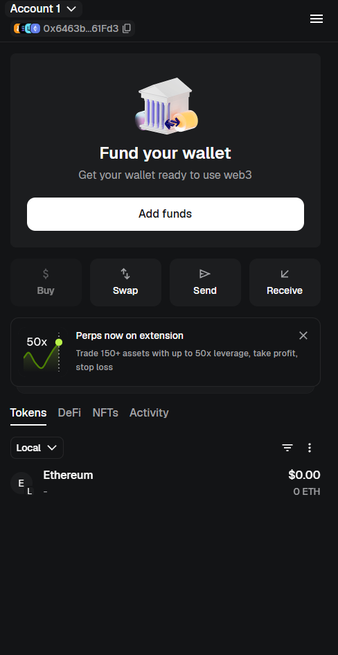
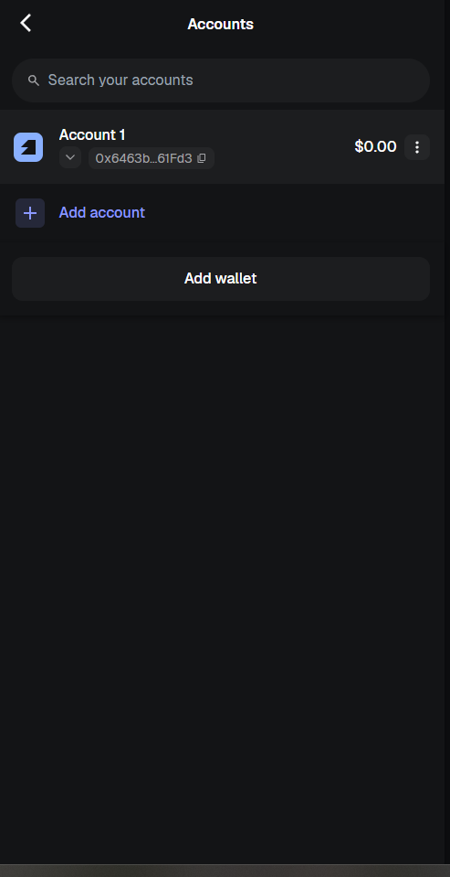
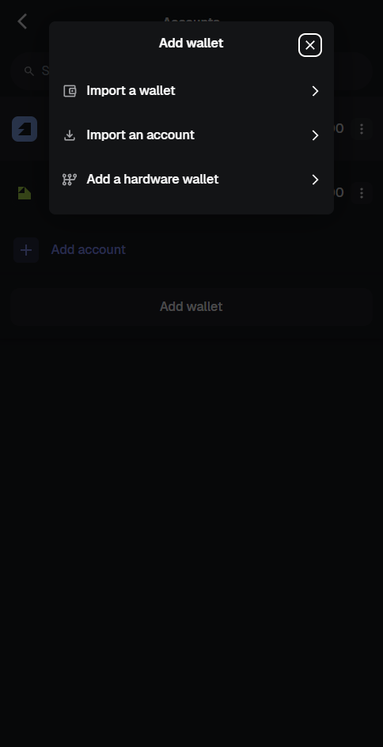
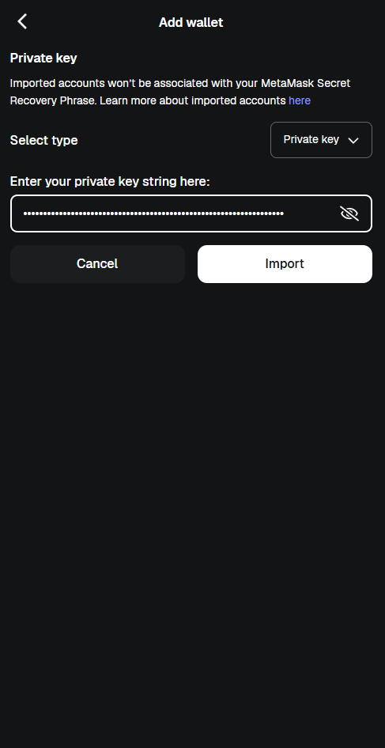

# Clave Backend (Smart Contracts)

O **Clave Backend** é o repositório responsável pelos contratos inteligentes (Smart Contracts) do sistema Clave. Este projeto utiliza o **Hardhat** como ambiente de desenvolvimento e testes para a rede Ethereum, e implementa um token ERC721 (NFT) customizado para gerenciar a venda de mesas (ingressos) e check-ins para a Vesperata de Diamantina.

## Arquitetura e Funcionalidades

O contrato principal, `Clave.sol`, herda implementações seguras da biblioteca **OpenZeppelin** (como `ERC721`, `ERC721Enumerable`, e `AccessControl`). Suas principais responsabilidades incluem:

* **Gestão de Organizadores e Apresentações:** O organizador pode criar apresentações, definir preços de mesas e horários.
* **Venda de Mesas (NFTs):** Usuários compram mesas para sessões específicas, recebendo um NFT que representa o ingresso.
* **Check-in Seguro:** Utiliza assinaturas criptográficas (ECDSA) para validar o check-in feito por operadores designados, garantindo que o portador do ingresso é quem está acessando o evento.
* **Gestão Financeira:** Gerencia o acúmulo de fundos por apresentação, aplicando taxas de serviço e permitindo o saque pelo organizador após um período de segurança (*withdrawal delay*).

## Pré-requisitos

* [Node.js](https://nodejs.org/) (versão 18+ recomendada)
* [npm](https://www.npmjs.com/) ou [yarn](https://yarnpkg.com/)

## Instruções para Rodar o Projeto

1.  **Instalar dependências:**
    ```bash
    npm install
    ```

2.  **Iniciar a rede local (Hardhat Network):**
    Inicie um nó blockchain local. Isso criará uma rede de testes na sua máquina, além de providenciar 20 contas com Ethereum fictício (ETH) para testes.
    ```bash
    npm run node
    ```
    *(Deixe este terminal aberto enquanto estiver testando)*

3.  **Fazer o deploy do contrato na rede local:**
    Em um **novo terminal**, execute o script de deploy:
    ```bash
    npm run deploy:ignition
    ```

> **Importante sobre Permissões (Roles):** Durante o deploy, o módulo Ignition (`ignition/modules/Clave.ts`) configura automaticamente as permissões iniciais usando as contas de teste geradas pelo Hardhat:
> * A **Conta #0** (Account 0) recebe a função de **Administrador Padrão** (`DEFAULT_ADMIN_ROLE`), tendo controle total sobre as configurações do contrato.
> * A **Conta #1** (Account 1) recebe a função de **Minter** (`MINTER_ROLE`).

## Configurando a Carteira (MetaMask) para a Rede Local

Para interagir com o contrato através de um frontend ou dApp, você precisará configurar sua carteira (como a MetaMask) para reconhecer a rede local do Hardhat:

1. Instale/Abra a extensão MetaMask no seu navegador.
2. Abra o menu de configurações (no canto superior direito) e clique em **Networks** (Redes).

<p align="center">
  
</p>

3. No menu de gerenciamento, clique no botão **"Add a custom network"** (Adicionar uma rede manualmente) na parte inferior.

<p align="center">
  
</p>

4. Preencha os campos com os seguintes dados da sua rede Hardhat local:
   * **Nome da rede** (*Network name*): `Local`
   * **Nova URL do RPC** (*New RPC URL*): `http://127.0.0.1:8545`
   * **ID da cadeia** (*Chain ID*): `31337`
   * **Símbolo da moeda** (*Currency symbol*): `ETH`

<p align="center">
  
</p>

5. Clique em **Salvar**. Agora sua carteira está conectada ao nó local do Hardhat!

---

## Importando Contas de Teste na MetaMask

Quando você executa o comando `npm run node`, o Hardhat gera 20 contas de teste (*Accounts*), cada uma abastecida com 10.000 ETH fictícios para uso local, e exibe as suas respectivas **Private Keys** (Chaves Privadas) no terminal.

Para interagir com o sistema simulando os diferentes atores e permissões do ecossistema Clave, você pode importar essas chaves diretamente para a sua MetaMask.

### Convenção Recomendada para Organização de Contas

Para evitar confusão ao alternar entre os papéis durante a validação do sistema, recomenda-se renomear as contas importadas utilizando o padrão: 
`#ID_Hardhat - Função - Últimos 4 dígitos do Endereço`.

Como o Hardhat gera endereços determinísticos, você pode mapear os papéis do ecossistema conforme os exemplos práticos abaixo:

| ID Hardhat | Função no Sistema | Exemplo de Nome na MetaMask | Descrição da Permissão |
| :---: | :--- | :--- | :--- |
| **Account #0** | Administrador Padrão | `#0 - Admin - 2266` | Controle total do contrato (`DEFAULT_ADMIN_ROLE`). |
| **Account #1** | Minter / Emissor | `#1 - Minter - 79C8` | Permissão para cunhar novos blocos de ingressos (`MINTER_ROLE`). |
| **Account #2** | Organizador do Evento | `#2 - Organizador - 93BC` | Gerencia apresentações, preços de mesas e horários. |
| **Account #3** | Operador de Validação 1 | `#3 - Operador 1 - b906` | Realiza o check-in e validação de assinaturas na portaria. |
| **Account #4** | Operador de Validação 2 | `#4 - Operador 2 - 6A65` | Realiza o check-in e validação de assinaturas na portaria. |
| **Account #5** | Operador de Validação 3 | `#5 - Operador 3 - A4dc` | Realiza o check-in e validação de assinaturas na portaria. |
| **Account #6** | Cliente Comprador A | `#6 - Cliente A - 0aa9` | Usuário comum que compra a mesa e recebe o NFT. |
| **Account #7** | Cliente Comprador B | `#7 - Cliente B - 9955` | Usuário comum que compra a mesa e recebe o NFT. |

### Passo a Passo da Importação:

1. **Acessar o Menu de Carteiras:** Na tela inicial da MetaMask, clique no seletor de contas centralizado no topo e selecione o botão **"Add wallet"** (Adicionar carteira) localizado na parte inferior.
2. **Selecionar o Tipo de Importação:** No menu flutuante que será exibido, clique na opção **"Import an account"** (Importar conta).

| Passo 1: Iniciar fluxo de adição | Passo 2: Selecionar importação de conta |
| :---: | :---: |
|  |  |

3. **Inserir a Chave Privada:** Vá até o terminal onde a rede local do Hardhat está rodando, copie a string hexadecimal correspondente à **Private Key** da conta desejada (ex: Account #0), cole-a no campo de texto e clique em **"Import"** (Importar).
4. **Renomear para Organização:** Para aplicar a convenção, clique nos três pontos ao lado da conta recém-importada, selecione **"Edit account name"** (Editar nome da conta) e aplique o padrão combinado (ex: `#0 - Admin - 2266`).

| Passo 3: Colar a Private Key do Hardhat | Passo 4: Customizar o nome da conta |
| :---: | :---: |
|  |  |

---

> ⚠️ **ATENÇÃO:** NUNCA envie fundos reais (Mainnet) para as contas geradas pelo Hardhat e nunca exponha suas chaves privadas reais de produção. As chaves expostas no terminal do Hardhat são públicas, conhecidas por toda a comunidade de desenvolvimento e servem estritamente para simulações locais de testes em redes *sandbox*.

## Integração com o Front-end

Após concluir a compilação, o deploy dos contratos inteligentes e a configuração da sua carteira MetaMask na rede local, o próximo passo é colocar a interface do usuário em execução. 

O código-fonte da aplicação cliente e os painéis de gerenciamento estão hospedados em um repositório dedicado. Para prosseguir, acesse:

**[Clave Frontend (Interface do Usuário)](https://github.com/davisonmota/clave-front)**

